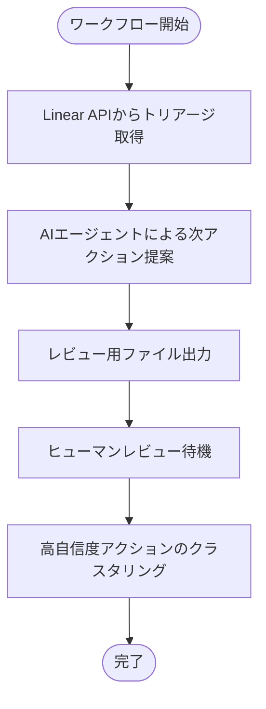
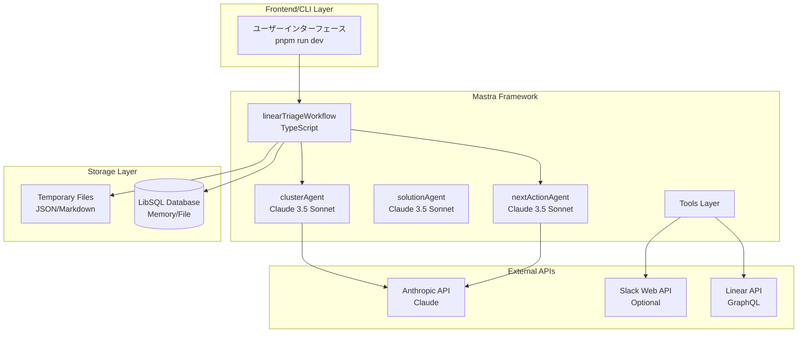
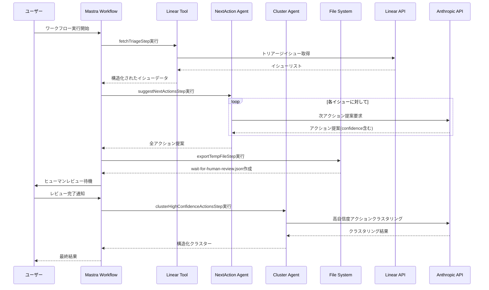

# Linear Triage「解決策ベース・クラスタリング」ハッカソン提案書

最終更新: 2025-09-06 (JST)

---

## 0. エグゼクティブサマリー

**課題**: Linear の triage には似通ったバグ/要望が多数蓄積し、分類・重複排除・優先度付けに時間がかかっている。  
**仮説**: 「テキストの類似度」ではなく **「共通の解決策（Solution）」** を軸にクラスタリングすると、**何を直せば複数の課題が一気に解決するか** が即座に見える。  
**解**: Linear から triage を読み込み、Claude が各課題に対し **解決策候補（最大5件）** と **補足質問** を生成。人間が候補を取捨選択/修正後、**確定解決策をキーに再クラスタリング**。結果を **ツリー形式の Markdown** でエクスポート。

- **初期スコープ**: Linear 読み取りのみ（書き込み/Slack送信は未実装）。
- **スピード最優先**: 精度より「人間が最終確認できる集合」を素早く提示。
- **Claude 活用**: アイデア出しではなく **ワークフロー中核**（解決策生成 → 質問生成 → 再クラスタリング → 出力）。
- **再現性**: README（実行手順、サンプル、パラメータ）を同梱。

---

## 1. 一問一答で確定したプロダクト方向

- 対象ユーザー: Linear を使う PM / EM / Tech Lead / PdM  
- 目的: triage の **分類時間を短縮**（完全自動ではなく、人間が最終確認できる状態まで一気に集約）  
- アプローチ: **「解決策」ベースのクラスタリング**（テキスト類似ではなく、同じ解決施策で片付く課題を束ねる）  
- 出力 UI: **ツリー構造 Markdown**（解決策 → 課題 → 起票者/補足）  
- LLM ラベル設計: **Bで開始（自由生成） → 時間ができたら辞書化（A）**  
- 連携スコープ（初回）: **Linear 読み取りのみ**、Slack は未対応（質問文は Markdown に含めて手動送信想定）  
- 展開計画: **まず社内利用**で磨き込み、必要に応じて機能拡張

---

## 2. 評価項目とのマッピング（採点表）

1) **ユーザー価値/課題の明確さ**  
- 誰に: Linear 利用の PM/EM/Tech Lead  
- 何を: triage の「分類・重複排除・優先度づけ」に費やす時間を削減  
- どうやって: 解決策ベースで課題群を束ね、**「どの施策が最も効果が大きいか」を可視化**  
- 根拠（定量/定性）:  
  - 定量: (a) クラスタリング前後で triage に要した**総時間**、(b) 重複課題の**削減率**、(c) **1スプリントに着手できた施策数**  
  - 定性: PM/EM の満足度、意思決定の速さ/迷いの減少

2) **実装の実在性・再現性**  
- 主要機能が動く、初回起動〜成功パスが安定  
- README で Linear 読み取り→解決策生成→人間レビュー→再クラスタリング→Markdown 出力まで再現可能

3) **新規性・技術的創意**  
- 類似度ベースではなく**解決策ラベル**を生成・正規化してクラスタ  
- ラベルは**多重付与**可能→横断テーマ（例: 通知設計、権限、インデックス最適化）を俯瞰

4) **Claude 活用の巧みさ**  
- **解決策の一貫性保持**: 同一プロジェクト内で過去生成した解決策を参照し、用語統一・アプローチの整合性を自動維持  
- **構造化された出力**: JSON 構造化出力、関数呼び出し的 I/O、プロンプト注入対策、再実行の安定性（温度/長さ/文体統制）  
- **human-in-the-loop**: 人間レビューのフィードバックを反映した**再クラスタリング**で計画性を担保

5) **継続性/展開計画**  
- 社内利用から開始→辞書化・Slack 連携・Linear 書き込み拡張  
- KPI で効果検証→必要なら OSS/SaaS へ発展

---

## 3. 機能要件（MVP）

### 3.1 必須
- [INGEST] Linear triage の課題を GraphQL/API で読み込む（Issue ID、Title、Description、Reporter、Labels、CreatedAt など）。
- [ANALYZE] 課題ごとに Claude が以下を生成：  
  - `solutions`: 最大5件、**実行可能な解決策**（短い命名＋説明＋想定影響範囲＋想定リスク/依存）  
  - `questions`: 補足が必要な具体的**質問リスト**（Yes/No 回答可能 or 短文で回答可能）  
- [REVIEW] 人間が solutions を取捨選択/修正（Markdown ないし JSON 編集）。
- [CLUSTER] **レビュー済み solutions** をキーにクラスタリング（多重ラベル可）。
- [EXPORT] **ツリー構造の Markdown** を出力：  
  - 解決策（代表名 / 代表説明 / 該当件数 / 合計影響見積り）  
  - ├─ 課題（ID/Title/要約/リンク/起票者/重要メタ）  
  - └─ 参考: 補足質問（未解決のみ）

### 3.2 任意（後回し）
- Linear へのコメント/ラベル付与、重複候補リンク
- Slack への自動投稿（質問）
- 事前定義辞書（Solution Taxonomy）の導入・メンテ UI

---

## 4. 非機能要件

- **再現性**: seed/temperature 等の固定、同じ入力で同じ出力を極力再現  
- **信頼性**: 失敗時の再試行、部分的失敗でも最終エクスポートは可能  
- **セキュリティ**: API キー・トークンは環境変数管理。個人情報/機微情報は出力に含めない設定を既定  
- **パフォーマンス**: 100〜1,000件の triage を 5〜10分程度でバッチ処理（並列ワーカー/レート制御）  
- **可観測性**: 各ステップの処理数・失敗数・LLMトークン量をログ/メトリクス化

---

## 5. アーキテクチャ & ワークフロー

### 5.1 全体フロー図



### 5.2 技術スタック別詳細フロー



### 5.3 ワークフロー実行シーケンス



---

## 6. データモデル（内部）

```json
// issue.jsonl (ingest)
{
  "issue_id": "LIN-1234",
  "title": "Notification arrives late on mobile",
  "description": "Users report ...",
  "reporter": "alice",
  "labels": ["bug", "mobile", "notification"],
  "url": "https://linear.app/...",
  "created_at": "2025-09-01T02:34:00Z"
}
```
```json
// solutions.jsonl (LLM raw output)
{
  "issue_id": "LIN-1234",
  "solutions": [
    {"name": "通知送出キューの遅延改善", "summary": "...", "impact": "中〜大", "risk": "低", "deps": ["queue", "worker"]},
    {"name": "モバイルのバックグラウンド配信見直し", "summary": "...", "impact": "中", "risk": "中", "deps": ["mobile"]}
  ],
  "questions": [
    "遅延は iOS/Android のどちらで再現しますか？",
    "遅延の中央値/95パーセンタイルは？"
  ]
}
```
```json
// reviewed_solutions.jsonl（人手で取捨選択/修正後）
{
  "issue_id": "LIN-1234",
  "solutions": [
    {"name": "通知送出キューの遅延改善", "summary": "ワーカー拡張とリトライ調整", "impact": "大", "risk": "低"}
  ]
}
```
```json
// clusters.json（クラスタリング結果）
{
  "solution": {"name": "通知送出キューの遅延改善", "summary": "..." },
  "issues": [
    {"issue_id":"LIN-1234","title":"...","url":"...","reporter":"alice"},
    {"issue_id":"LIN-1357","title":"...","url":"...","reporter":"bob"}
  ],
  "stats": {"count": 12, "first_seen":"...", "last_seen":"..."}
}
```

---

## 7. 出力フォーマット（ツリー Markdown）サンプル

```markdown
# Solution Cluster Report (YYYY-MM-DD)

## 🔧 通知送出キューの遅延改善 — 12件
- 概要: ワーカー拡張とリトライ調整。mobile 影響あり。
- 推定影響: 大 / リスク: 低

### 該当課題
- LIN-1234: Notification arrives late on mobile — by alice  
  https://linear.app/...
- LIN-1357: Delayed push on Android — by bob  
  https://linear.app/...

### 未解決の補足質問
- iOS/Android のどちらで再現？
- 遅延の中央値/95p は？

---

## 🧭 権限モデルの見直し — 8件
...
```

---

## 8. API & 実装インターフェース（擬似コード）

### 8.1 Linear 取り込み（read-only）
- 認証: `LINEAR_API_KEY` 環境変数
- 取得対象: triage view の Issue 一覧（GraphQL）

```ts
// pseudo TypeScript
const issues = await fetchLinearIssues({ view: "triage" });
saveJsonl("issue.jsonl", issues);
```

### 8.2 解決策/質問 生成（Claude）
- 入力: `issue.jsonl`
- 出力: `solutions.jsonl`（構造化 JSON）

```ts
for (const issue of issues) {
  const prompt = buildSolutionPrompt(issue);
  const res = await callClaudeJSON(prompt, { temperature: 0.2, maxTokens: 1200 });
  appendJsonl("solutions.jsonl", res);
}
```

**出力スキーマ（厳格化）**
```json
{
  "type":"object",
  "properties": {
    "issue_id":{"type":"string"},
    "solutions":{"type":"array","items":{"type":"object","properties":{
      "name":{"type":"string","maxLength":80},
      "summary":{"type":"string","maxLength":280},
      "impact":{"type":"string","enum":["小","中","大"]},
      "risk":{"type":"string","enum":["低","中","高"]},
      "deps":{"type":"array","items":{"type":"string"}}
    }}},
    "questions":{"type":"array","items":{"type":"string","maxLength":120}}
  },
  "required":["issue_id","solutions","questions"]
}
```

### 8.3 人手レビュー
- フォーマット: Markdown か JSONL で編集  
- CLI 支援: `review open solutions.jsonl` で VSCode を開く、`review validate` でスキーマ検証

### 8.4 クラスタリング
- 入力: `reviewed_solutions.jsonl`
- 出力: `clusters.json` / `clusters.md`

アルゴリズム（簡易版）:
1. `name` を正規化（全角半角/句読点/助詞除去/ステミング）
2. 文字列距離＋埋め込み近傍で**候補マージ**（しきい値2段階）
3. 人手調整なしで自動グループ化（多重所属も可）
4. グループごとに代表名/代表説明を LLM で要約再生成（温度低め）

---

## 9. Claude プロンプト設計（要旨）

### 9.1 解決策候補 生成
- **指示**: 入力課題の根本原因/技術領域を推定し、**実行可能な解決策名（<=80字）と要約（<=280字）** を最大5件。  
- **出力**: JSON（上記スキーマ）。
- **ガード**: 「不明」「調査」だけの提案を禁止。結果に**観測可能な指標**（例: p95遅延）を含める。

### 9.2 補足質問 生成
- **指示**: 実装判断を確度高くするための**Yes/No または短答**。抽象的な質問は禁止。

### 9.3 再クラスタリング
- **指示**: レビュー後の `solutions.name/summary` 群を入力に、**同義/包含**の観点でクラスタリング。代表名/説明を生成。

### 9.4 注入対策/安定化
- system プロンプトで **役割固定/出力スキーマ固定**、不許可命令を無視  
- `temperature=0.2`、`top_p=0.9`、`max_tokens` 制限  
- JSON パース不能時は自動再試行（最大3回）

---

## 10. README（再現手順）

### 10.1 事前準備
- Node.js 18+ あるいは Python 3.11+（どちらでも可/参考スクリプト同梱）  
- 環境変数:  
  - `LINEAR_API_KEY`: Linear の API キー（読み取り権限）  
  - `ANTHROPIC_API_KEY`: Claude 用 API キー

### 10.2 コマンド（例：Node版）
```bash
pnpm i
pnpm ingest:linear --view triage --out issue.jsonl
pnpm generate:solutions --in issue.jsonl --out solutions.jsonl
# （人手で solutions.jsonl を編集して reviewed_solutions.jsonl を作成）
pnpm cluster --in reviewed_solutions.jsonl --out clusters.json
pnpm export:md --in clusters.json --out clusters.md
```

### 10.3 成功パス
- `clusters.md` が生成され、ツリー構造で課題が整理されていること。

---

## 11. KPI / 計測設計

- **Triage 時間短縮率**: ベースライン比で何%短縮したか  
- **重複課題削減率**: クラスタリング後に重複/類似起票がどれだけ減るか  
- **着手施策数/スプリント**: 上位クラスタの施策着手が増えるか  
- **再現失敗率**: LLM 出力の JSON パース失敗/再試行回数  
- **ユーザー満足度**: PM/EM の主観評価（NPS/CSAT）

---

## 12. ULTRA-THINK（前提/リスク/代替/トレードオフ）

- **前提**: 課題文に十分な文脈がある、Linear のメタデータが取得できる  
- **リスク**: 解決策名のバラつき→クラスタ乱立  
  - **緩和**: 正規化＋近傍マージ＋「代表名生成」を LLM に二段活用  
- **代替**: Embedding 類似＋モデレーションで「ほぼ重複」検知を補助（MVP 後）  
- **トレードオフ**: 精度 vs スピード → **スピードを優先**し、人間の最終確認を前提にリスクを抑制

---

## 13. 今後の拡張（Now / Next / Later）

- **Now（ハッカソン）**: Linear 読み取り → 解決策生成 → 人手レビュー → 再クラスタ → Markdown 出力  
- **Next**: Slack 連携（質問の半自動投稿）、Linear コメント/ラベル書き戻し、**Solution 辞書化**  
- **Later**: ダッシュボード化（履歴/トレンド）、SaaS/OSS 展開、RBAC、監査ログ

---

## 14. 受け入れ基準（DoD）

- `pnpm` コマンドのみで **クリーン環境から再現**できる  
- 50件以上の triage で **clusters.md が生成**される  
- 出力の **代表クラスタ3件以上**が「今すぐ使いたい」レベルで意思決定を促す  
- LLM 出力は **100% スキーマ検証**を通過

---

## 15. 発表用デモ台本（3〜4分）

1. 課題: triage の「似た課題地獄」  
2. 解決: **解決策ベース**で束ねると、施策インパクトが見える  
3. ライブ: ingest → solutions 生成 → 人手で1件修正 → cluster → `clusters.md` を開く  
4. 価値: 「この施策をやれば 12件消える」が一目で分かる  
5. 継続: 社内で運用→辞書化/Slack/書き戻し→展開

---

## 16. 付録 A: プロンプト雛形（要約）

**System**: あなたはソフトウェア開発のアーキテクト兼 SRE です。…（役割固定/禁則/JSON厳守）。  
**User**: 課題 JSON を渡す。  
**Assistant**: `solutions`（最大5）と `questions` を JSON で返す。  
- 禁止: 「調査が必要」だけの提案、抽象質問、スキーマ違反。  
- 要件: 影響の見積り軸（ユーザー影響/運用コスト/リスク）を明記。

---

## 17. 付録 B: スキーマバリデーション（JSON Schema）

（上記に記載のスキーマを使用。CI に jsonschema 検証を追加すると安定化）

---

## 18. 付録 C: ライセンス/コンプライアンス注意

- API キーは .env 管理、リポジトリに含めない  
- 起票者名等の個人情報が含まれる可能性→ Markdown 配布時は**匿名化オプション**

---
