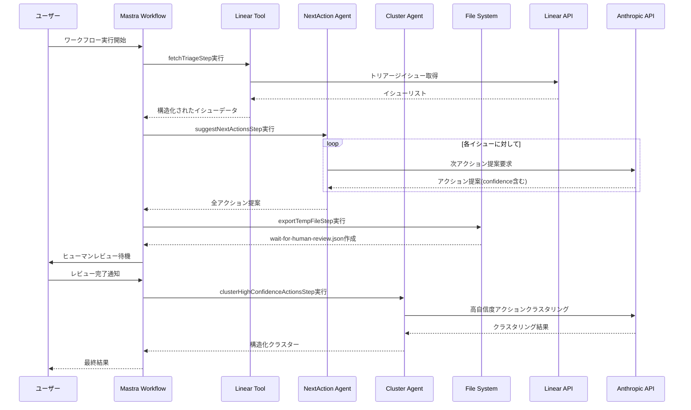

# Linear Triage「解決策ベース・クラスタリング」ハッカソン提案書

最終更新: 2025-09-07 (JST)

---

## 1. 環境のセットアップ

### 1.1 環境変数のセットアップ
```bash
cp apps/agent/.env.example apps/agent/.env
```
- `LINEAR_API_KEY`: Linear の API キー（読み取り権限）  
- `ANTHROPIC_API_KEY`: Claude 用 API キー
- `SLACK_TOKEN`: Slack 用 API キー

### 1.2 インストールと開発サーバーの起動
```bash
pnpm i
pnpm dev
```

### 1.3 使用方法
1. 開発サーバー起動後、ウェブアプリのサイドバーから **Workflows** に移動
2. **linear-triage-workflow** を選択
3. トリアージ取得設定を入力：
   - `team`: Linear チーム名
   - `count`: 取得する課題件数
4. **Run** を押下してワークフロー実行
5. しばらく待つと `apps/agent/wait-for-human-review.json` が作成される
6. このファイルでAIが提案した次のアクションをレビュー・編集
7. ウェブアプリに戻り **Approve** を押下
8. 最終的に `apps/agent/clustered.json` が出力される

---

## 2. エグゼクティブサマリー

**課題**: Linear の triage には似通ったバグ/要望が多数蓄積し、分類・重複排除・優先度付けに時間がかかっている。  
**仮説**: 「テキストの類似度」ではなく **「共通の解決策（Solution）」** を軸にクラスタリングすると、**何を直せば複数の課題が一気に解決するか** が即座に見える。  
**解**: Linear から triage を読み込み、Claude が各課題に対し **解決策候補（最大5件）** と **補足質問** を生成。人間が候補を取捨選択/修正後、**確定解決策をキーに再クラスタリング**。結果を **JSON形式** でエクスポート。

- **初期スコープ**: Linear 読み取りのみ（書き込み/Slack送信は未実装）。
- **スピード最優先**: 精度より「人間が最終確認できる集合」を素早く提示。
- **Claude 活用**: アイデア出しではなく **ワークフロー中核**（解決策生成 → 質問生成 → 再クラスタリング → 出力）。
- **再現性**: README（実行手順、サンプル、パラメータ）を同梱。

---

## 3. 一問一答で確定したプロダクト方向

- 対象ユーザー: Linear を使う PM / EM / Tech Lead / PdM  
- 目的: triage の **分類時間を短縮**（完全自動ではなく、人間が最終確認できる状態まで一気に集約）  
- アプローチ: **「解決策」ベースのクラスタリング**（テキスト類似ではなく、同じ解決施策で片付く課題を束ねる）  
- 出力 UI: **JSON形式**（解決策 → 課題 → 起票者/補足）  
- LLM ラベル設計: **Bで開始（自由生成） → 時間ができたら辞書化（A）**  
- 連携スコープ（初回）: **Linear 読み取りのみ**、Slack は未対応（質問文は JSON に含めて手動送信想定）  
- 展開計画: **まず社内利用**で磨き込み、必要に応じて機能拡張

---

## 4. 評価項目とのマッピング（採点表）

1) **ユーザー価値/課題の明確さ**  
- 誰に: Linear 利用の PM/EM/Tech Lead  
- 何を: triage の「分類・重複排除・優先度づけ」に費やす時間を削減  
- どうやって: 解決策ベースで課題群を束ね、**「どの施策が最も効果が大きいか」を可視化**  
- 根拠（定量/定性）:  
  - 定量: (a) クラスタリング前後で triage に要した**総時間**、(b) 重複課題の**削減率**、(c) **1スプリントに着手できた施策数**  
  - 定性: PM/EM の満足度、意思決定の速さ/迷いの減少

2) **実装の実在性・再現性**  
- 主要機能が動く、初回起動〜成功パスが安定  
- README で Linear 読み取り→解決策生成→人間レビュー→再クラスタリング→JSON 出力まで再現可能

3) **新規性・技術的創意**  
- 類似度ベースではなく**解決策ラベル**を生成・正規化してクラスタ  
- ラベルは**多重付与**可能→横断テーマ（例: 通知設計、権限、インデックス最適化）を俯瞰

4) **Claude 活用の巧みさ**  
- **解決策の一貫性保持**: 同一プロジェクト内で過去生成した解決策を参照し、用語統一・アプローチの整合性を自動維持  
- **構造化された出力**: JSON 構造化出力、関数呼び出し的 I/O、プロンプト注入対策、再実行の安定性（温度/長さ/文体統制）  
- **human-in-the-loop**: 人間レビューのフィードバックを反映した**再クラスタリング**で計画性を担保

5) **継続性/展開計画**  
- 社内利用から開始→辞書化・Slack 連携・Linear 書き込み拡張  
- KPI で効果検証→必要なら OSS/SaaS へ発展

---

## 5. 機能要件（MVP）

### 5.1 必須
- [INGEST] Linear triage の課題を GraphQL/API で読み込む（Issue ID、Title、Description、Reporter、Labels、CreatedAt など）。
- [ANALYZE] 課題ごとに Claude が以下を生成：  
  - `solutions`: 最大5件、**実行可能な解決策**（短い命名＋説明＋想定影響範囲＋想定リスク/依存）  
  - `questions`: 補足が必要な具体的**質問リスト**（Yes/No 回答可能 or 短文で回答可能）  
- [REVIEW] 人間が solutions を取捨選択/修正（JSON 編集）。
- [CLUSTER] **レビュー済み solutions** をキーにクラスタリング（多重ラベル可）。
- [EXPORT] **JSON形式** を出力：  
  - 解決策（代表名 / 代表説明 / 該当件数 / 合計影響見積り）  
  - 該当課題（ID/Title/要約/リンク/起票者/重要メタ）  
  - 参考: 補足質問（未解決のみ）

### 5.2 任意（後回し）
- Linear へのコメント/ラベル付与、重複候補リンク
- Slack への自動投稿（質問）
- 事前定義辞書（Solution Taxonomy）の導入・メンテ UI


## 6. 非機能要件

- **再現性**: seed/temperature 等の固定、同じ入力で同じ出力を極力再現  
- **信頼性**: 失敗時の再試行、部分的失敗でも最終エクスポートは可能  
- **セキュリティ**: API キー・トークンは環境変数管理。個人情報/機微情報は出力に含めない設定を既定  
- **パフォーマンス**: 100〜1,000件の triage を 5〜10分程度でバッチ処理（並列ワーカー/レート制御）  
- **可観測性**: 各ステップの処理数・失敗数・LLMトークン量をログ/メトリクス化

---

## 7. アーキテクチャ & ワークフロー

### 7.1 全体フロー図


### 7.2 技術スタック別詳細フロー


### 7.3 ワークフロー実行シーケンス



---

## 8. 出力フォーマット（JSON）サンプル

```json
{
  "clusters": [
    {
      "id": "notification-queue-improvement",
      "title": "通知送出キューの遅延改善",
      "description": "ワーカー拡張とリトライ調整。mobile 影響あり。",
      "issueCount": 12,
      "estimatedImpact": "大",
      "estimatedRisk": "低",
      "issues": [
        {
          "id": "LIN-1234",
          "title": "Notification arrives late on mobile",
          "reporter": "alice",
          "url": "https://linear.app/...",
          "summary": "モバイル通知の遅延問題"
        }
      ],
      "unresolvedQuestions": [
        "iOS/Android のどちらで再現？",
        "遅延の中央値/95p は？"
      ]
    }
  ]
}
```

---

## 9. KPI / 計測設計

- **Triage 時間短縮率**: ベースライン比で何%短縮したか  
- **重複課題削減率**: クラスタリング後に重複/類似起票がどれだけ減るか  
- **着手施策数/スプリント**: 上位クラスタの施策着手が増えるか  
- **再現失敗率**: LLM 出力の JSON パース失敗/再試行回数  
- **ユーザー満足度**: PM/EM の主観評価（NPS/CSAT）

---

## 10. 今後の拡張（Now / Next / Later）

- **Now（ハッカソン）**: Linear 読み取り → 解決策生成 → 人手レビュー → 再クラスタ → JSON 出力  
- **Next**: Slack 連携（質問の半自動投稿）、Linear コメント/ラベル書き戻し、**Solution 辞書化**  
- **Later**: ダッシュボード化（履歴/トレンド）、SaaS/OSS 展開、RBAC、監査ログ
